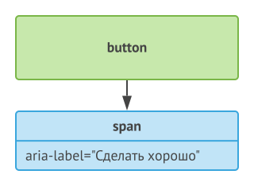
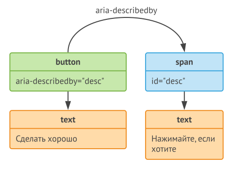

# Доступные имя и описание

:warning: Этот материал не является руководством по указанию доступных имен и описаний,
а лишь показывает алгоритм их генерации

## Что такое доступные имя и описание?

**Доступное имя** (далее просто имя) - название элемента интерфейса,
которое однозначно и понятно описывает его назначение

:bulb: При чтении элемента экранный диктор озвучивает его имя,
а программы для распознавания речи позволяют пользователю выбирать элементы интерфейса,
называя их по имени

**Доступное описание** (далее просто описание) - уточняющее дополнение к имени

:bulb: При наличии описания экранный диктор озвучивает его после имени

### Имя для кнопки

```html
<button>Отправить сообщение</button>
```

NVDA | VoiceOver
---- | ---------
Отправить сообщение, кнопка | Отправить сообщение, кнопка

### Описание для кнопки

```html
<button
  aria-describedby="desc">
  Отправить сообщение
</button>

<span
  id="desc">
  Отменить действие невозможно
</span>
```

NVDA | VoiceOver
---- | ---------
Отправить сообщение, кнопка - Отменить действие невозможно | Отправить сообщение, кнопка - Отменить действие невозможно

## Как генерируются имя и описание?

Имя или описание - это строка, которая состоит из одного или нескольких слов

Слова генерируются на основании содержимого определенных атрибутов, элементов
и собираются вместе

## Как указывать имя и описание?

:warning: Все приведенные ниже примеры были протестированы в браузере Google Chrome
экранным диктором VoiceOver на операционной системе macOS Mojave
и экранным диктором NVDA на операционной системе Windows 10
В иных операционных системах, браузерах и для иных экранных дикторов
результаты могут быть немного другими

Существует 4 основных способа указания имени, и у каждого свои особенности

### Вложенный контент

#### Вложенный текст

```html
<button>Сделать хорошо</button>
```


NVDA | VoiceOver
---- | ---------
Сделать хорошо, кнопка | Сделать хорошо, кнопка

#### Вложенный элемент

```html
<button>
  <span>Сделать хорошо</span>
</button>
```


NVDA | VoiceOver
---- | ---------
Сделать хорошо, кнопка | Сделать хорошо, кнопка

### Элемент `label` и атрибут `alt`

#### Элемент `label`

```html
<label
  for="button">
  Сделать хорошо
</label>

<button id="button"></button>
```


NVDA | VoiceOver
---- | ---------
Сделать хорошо, кнопка | Сделать хорошо, кнопка

##### Элемент `label` более приоритетный, чем вложенный контент

```html
<label
  for="button">
  Сделать хорошо
</label>

<button
  id="button">
  Сделать плохо
</button>
```


NVDA | VoiceOver
---- | ---------
Сделать хорошо, кнопка | Сделать хорошо, кнопка

#### Атрибут `alt`

```html

```


NVDA | VoiceOver
---- | ---------
Рыжий кот спит на клавиатуре, графика | Рыжий кот спит на клавиатуре, изображение

### Атрибут `aria-label`

```html
<button aria-label="Сделать хорошо"></button>
```


NVDA | VoiceOver
---- | ---------
Сделать хорошо, кнопка | Сделать хорошо, кнопка

#### Атрибут `aria-label` работает не только на элементе, для которого вычисляется имя

```html
<button>
  <span aria-label="Сделать хорошо"></span>
</button>
```



NVDA | VoiceOver
---- | ---------
Сделать хорошо, кнопка | Сделать хорошо, кнопка

#### Атрибут `aria-label` более приоритетный, чем элемент `label` и вложенный контент

```html
<label
  for="button">
  Сделать плохо
</label>

<button
  id="button"
  aria-label="Сделать хорошо">
  Сделать плохо
</button>
```


NVDA | VoiceOver
---- | ---------
Сделать хорошо, кнопка | Сделать хорошо, кнопка

#### Атрибут `aria-label` более приоритетный, чем атрибут `alt`

```html

```


NVDA | VoiceOver
---- | ---------
Рыжий кот спит на клавиатуре, графика | Рыжий кот спит на клавиатуре, изображение

### Атрибут `aria-labelledby`

```html
<button aria-labelledby="label"></button>

<span
  id="label">
  Сделать хорошо
</span>
```


NVDA | VoiceOver
---- | ---------
Сделать хорошо, кнопка | Сделать хорошо, кнопка

#### Атрибут `aria-labelledby` работает не только на элементе, для которого вычисляется имя

```html
<button>
  <span aria-labelledby="label"></span>
</button>

<span
  id="label">
  Сделать хорошо
</span>
```


NVDA | VoiceOver
---- | ---------
Сделать хорошо, кнопка | Сделать хорошо, кнопка

#### Атрибут `aria-labelledby` может указывать на несколько элементов

```html
<button aria-labelledby="label-1 label-2"></button>

<span
  id="label-1">
  Сделать хорошо
</span>

<span
  id="label-2">
  Не делать плохо
</span>
```


NVDA | VoiceOver
---- | ---------
Сделать хорошо Не делать плохо, кнопка | Сделать хорошо Не делать плохо, кнопка

##### Порядок указания элементов в атрибуте `aria-labelledby` определяет порядок их обработки

```html
<button aria-labelledby="label-2 label-1"></button>

<span
  id="label-1">
  Сделать хорошо
</span>

<span
  id="label-2">
  Не делать плохо
</span>
```


NVDA | VoiceOver
---- | ---------
Не делать плохо Сделать хорошо, кнопка | Не делать плохо Сделать хорошо, кнопка

#### Атрибут `aria-labelledby` более приоритетный, чем атрибут `aria-label`, элемент `label` и вложенный контент

```html
<label
  for="button">
  Сделать плохо
</label>

<button
  id="button"
  aria-label="Сделать плохо"
  aria-labelledby="label">
  Сделать плохо
</button>

<span
  id="label">
  Сделать хорошо
</span>
```


NVDA | VoiceOver
---- | ---------
Сделать хорошо, кнопка | Сделать хорошо, кнопка

#### Атрибут `aria-labelledby` более приоритетный, чем атрибут `alt`

```html


<span
  id="label">
  Рыжий кот спит на клавиатуре
</span>
```


NVDA | VoiceOver
---- | ---------
Рыжий кот спит на клавиатуре, графика | Рыжий кот спит на клавиатуре, изображение

#### Если элемент через атрибут `aria-labelledby` указывает сам на себя, то менее приоритетные способы указания имени (например, вложенный контент) тоже работают

```html
<button
  id="button"
  aria-labelledby="button">
  Сделать хорошо
</button>
```


NVDA | VoiceOver
---- | ---------
Сделать хорошо, кнопка | Сделать хорошо, кнопка

#### Цепочка атрибутов `aria-labelledby` не работает, обрабатывается только первый атрибут

```html
<button aria-labelledby="label-1"></button>

<span
  id="label-1"
  aria-labelledby="label-2">
  Сделать хорошо
</span>

<span
  id="label-2">
  Сделать плохо
</span>
```


NVDA | VoiceOver
---- | ---------
Сделать хорошо, кнопка | Сделать хорошо, кнопка

#### Атрибут `aria-labelledby` не работает, если указывает на родительский элемент

```html
<button id="button">
  <span
    aria-labelledby="button">
    Сделать хорошо
  </span>
</button>
```


NVDA | VoiceOver
---- | ---------
кнопка | Сделать хорошо, кнопка

Для указания описания существует всего один способ

### Атрибут `aria-describedby`

```html
<button
  aria-describedby="desc">
  Сделать хорошо
</button>

<span
  id="desc">
  Нажимайте, если хотите
</span>
```



NVDA | VoiceOver
---- | ---------
Сделать хорошо, кнопка - Нажимайте, если хотите | Сделать хорошо, кнопка - Нажимайте, если хотите

#### Атрибут `aria-describedby` может указывать на несколько элементов

```html
<button
  aria-describedby="desc-1 desc-2">
  Сделать хорошо
</button>

<span
  id="desc-1">
  Нажимайте, если хотите
</span>

<span
  id="desc-2">
  Не нажимайте, если не хотите
</span>
```


NVDA | VoiceOver
---- | ---------
Сделать хорошо, кнопка - Нажимайте, если хотите Не нажимайте, если не хотите | Сделать хорошо, кнопка - Нажимайте, если хотите Не нажимайте, если не хотите

##### Порядок указания элементов в атрибуте `aria-describedby` определяет порядок их обработки

```html
<button
  aria-describedby="desc-2 desc-1">
  Сделать хорошо
</button>

<span
  id="desc-1">
  Нажимайте, если хотите
</span>

<span
  id="desc-2">
  Не нажимайте, если не хотите
</span>
```


NVDA | VoiceOver
---- | ---------
Сделать хорошо, кнопка - Не нажимайте, если не хотите Нажимайте, если хотите | Сделать хорошо, кнопка - Не нажимайте, если не хотите Нажимайте, если хотите

#### Цепочка атрибутов `aria-describedby` не работает, обрабатывается только первый атрибут

```html
<button
  aria-describedby="desc-1">
  Сделать хорошо
</button>

<span
  id="desc-1"
  aria-describedby="desc-2">
  Нажимайте, если хотите
</span>

<span
  id="desc-2">
  Не нажимайте
</span>
```


NVDA | VoiceOver
---- | ---------
Сделать хорошо, кнопка - Нажимайте, если хотите | Сделать хорошо, кнопка - Нажимайте, если хотите

#### При вычислении описания атрибут `aria-labelledby` не работает

```html
<button
  aria-describedby="desc">
  Сделать хорошо
</button>

<span
  id="desc"
  aria-labelledby="label">
  Нажимайте, если хотите
</span>

<span
  id="label">
  Не нажимайте
</span>
```


NVDA | VoiceOver
---- | ---------
Сделать хорошо, кнопка - Нажимайте, если хотите | Сделать хорошо, кнопка - Нажимайте, если хотите

#### При вычислении описания остальные атрибуты (например, `aria-label`) работают

```html
<button
  aria-describedby="desc">
  Сделать хорошо
</button>

<span
  id="desc"
  aria-label="Нажимайте, если хотите">
  Не нажимайте
</span>
```


NVDA | VoiceOver
---- | ---------
Сделать хорошо, кнопка - Нажимайте, если хотите | Сделать хорошо, кнопка - Нажимайте, если хотите

:warning: По спецификации атрибут `title` по приоритету находится на одном уровне
с элементом `label`, атрибутом `alt` и служит только для указания имени,
но на практике в разных случаях может работать, как описание элемента
или даже совсем не работать

## Примеры на закрепление материала

### Из-за более приоритетного атрибута `aria-label` менее приоритетный вложенный в кнопку контент не обрабатывается

```html
<button aria-label="Сделать хорошо">
  <span aria-labelledby="label"></span>
</button>

<span
  id="label">
  Сделать плохо
</span>
```


NVDA | VoiceOver
---- | ---------
Сделать хорошо, кнопка | Сделать хорошо, кнопка

### На кнопке нет никаких атрибутов, поэтому каждый вложенный элемент обрабатывается

```html
<button>
  <span aria-label="Сделать хорошо"></span>
  <span aria-labelledby="label"></span>
</button>

<span
  id="label">
  Не делать плохо
</span>
```


NVDA | VoiceOver
---- | ---------
Сделать хорошо Не делать плохо, кнопка | Сделать хорошо Не делать плохо, кнопка

```html
<button>
  Сделать
  <span>хорошо</span>
  <span aria-label="Не делать"></span>
  <span aria-labelledby="label"></span>
</button>

<span
  id="label">
  плохо
</span>
```


NVDA | VoiceOver
---- | ---------
Сделать хорошо Не делать плохо, кнопка | Сделать хорошо Не делать плохо, кнопка
